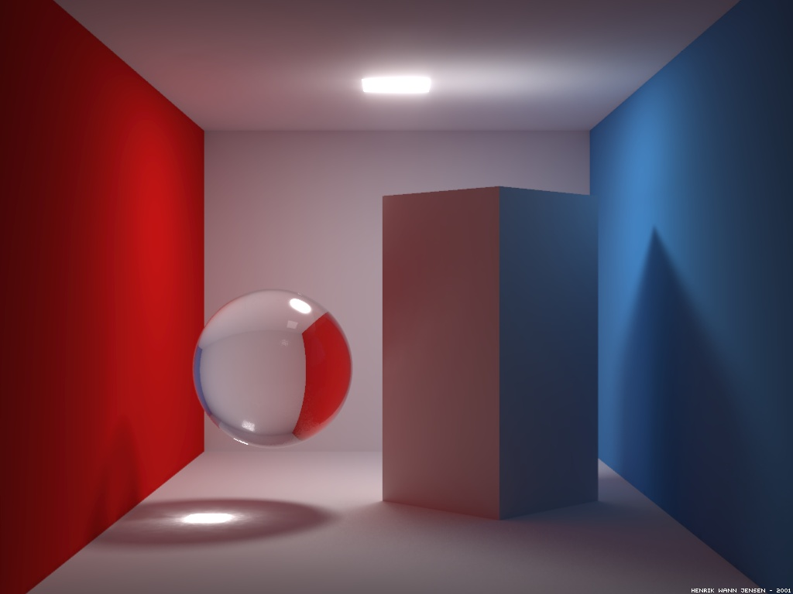

# *This project has been created as part of the 42 curriculum by mchanlia, lchiche*



# <span style="color:lime">MiniRT</span>

### <span style="color:mediumseagreen">**Short Description**</span> : 
> This project introduces the fundamentals of ray tracing, a rendering technique used to generate realistic images by simulating the behavior of light.
<br>

### <span style="color:mediumseagreen">**Table of Content**</span> :

| --- | Section | --- |
| :---: | :---: | :---: |
|1.|[Description](#description) | :large_blue_circle: |
|1.1|[Program Name](#program-name-) | :yellow_circle: |
|1.2|[Project Summary](#project-summary-) | :yellow_circle: |
|1.3|[Project Features](#project-features-) | :yellow_circle: |
|2.|[Instructions](#instructions) | :large_blue_circle: |
|2.1|[Installation](#installation-) | :yellow_circle: |
|2.2|[Usage](#usage-) | :yellow_circle: |
|2.2.1|[Window and Controls](#window-and-controls-) | :purple_circle: |
|2.2.2|[Scene File Configuration](#scene-file-configuration-) | :purple_circle: |
|2.2.3|[Output](#output-) | :purple_circle: |
|2.2.4|[Notes](#notes-) | :purple_circle: |
|3.|[Bonus](#bonus) | :large_blue_circle: |
|4.|[Resources](#resources) | :large_blue_circle: |
<br>

# <span style="color:skyblue">Description</span>

### <span style="color:yellow">**Program Name**</span> :
<span style="color:gold">MiniRT</span>

Introduction :

MiniRT is a project that introduces the fundamentals of **ray tracing**, a rendering technique used to generate realistic 3D images by simulating the behavior of light.

The goal is to build a minimal ray tracing engine in C capable of rendering simple scenes described in a `.rt` file.

The program handles:
- Light interactions such as **shadows, reflection, refraction and transparency**
- Basic geometric objects including **spheres, planes, cylinders and cones**
- Scene rendering using mathematical computations based on **vectors and matrices**
- Movement in the scene by changing camera properties

This project emphasizes understanding of:
- Linear algebra
- Ray-object intersection algorithms

### <span style="color:yellow">**Program Summary**</span> :
> MiniRT is a basic ray tracer developed in C.  
> It renders simple 3D scenes described in a `.rt` file.  
> The program handles light interactions such as ambient lighting, diffuse reflection and shadows.  
> Objects like spheres, planes, cylinders and cone are supported, along with camera positioning and light sources.  

### <span style="color:yellow">**Program Features**</span> :
> The program parses a scene description file and renders it in a window using the MiniLibX library.  
> Each object is mathematically computed using vectors and intersections.  
> The rendering includes lighting effects and object transformations to simulate a 3D environment.  
> The project emphasizes optimization, precision and understanding of linear algebra concepts.

<br>

# <span style="color:skyblue">Instructions</span>

### <span style="color:yellow">**Installation**</span> :
> ```bash  
> git clone <repo_url>  
> cd miniRT  
> make  

### <span style="color:yellow">**Usage**</span> :
> ```bash  
> ./miniRT path/to/scene.rt 
 
#### <span style="color:purple">**Window and Controls**</span> :
Opens a window and renders the scene using MiniLibX
The rendered scene includes:
- Objects: spheres, planes, cylinders, cones
- Lighting: ambient light, point lights, shadows
- Effects: reflection, refraction, transparency
- Pattern: stripes, gradient, rings

The camera is positioned and oriented according to the `.rt` file

To close the window, use `ESC`  
To move inside the scene use `WASD`  
To move up/down the scene use `RF`  
To change the orientation use `QE,TG,YH`  
To reset the camera position use `C`  
To toggle/untoggle patterns use `P`
<br>

#### <span style="color:purple">**Scene File Configuration**</span> :
A `.rt` file can define:
- Camera: position, orientation, field of view
- Lights: position, intensity, color
- Ambiant Light: intensity, color
- Objects: type, position, size, color
<br>

#### <span style="color:purple">**Output**</span> :
- Scene is rendered in real time
- Each pixel are computed one by one
- Closing the window terminates the program
<br>

#### <span style="color:purple">**Notes**</span> :
- Make sure your `.rt` file is correctly formatted according to the MiniRT specification
- Debug information may be printed in the terminal during rendering
- You can use `make basic_test` to try the default map with the valgrind command and its flags
- If you want to try some invalids maps, use `make invalid_maps`
<br>

# <span style="color:skyblue">Bonus</span>

> Support specular reflection for a full Phong reflection model.  
> Support Patterns : checkerboard and customs mades.  
> Support custom light colored spot-lights and multi-spots.  
> We added an additional Cone Object.  
> Script test to test wrong maps.  
> Automatic Minilibx installation and suppression.  
> Camera movements and map recompilations (Hooks).  
> Full transparency and Refraction/Reflection supports as well as Materia handling.  
> Shadows Handling.  
> Matrices transformation of objetcs are implented though only used for camera Positionning.  

#### Areas of improvement 
 - Area light and shading.
 - Motion blur.
 - Ray sampling (Anti-aliasing).
 - Multi-threading for performances overhauls.
<br>


# <span style="color:skyblue">Resources</span>

[Books : Jamis Buck](The_Ray_Tracer_Challenge_Jamis_Buck2019_Z-Library.pdf)  
[Reddit : vectors](https://www.reddit.com/r/mathshelp/comments/1odj784/whats_the_use_of_unit_vectors/)  
[Wikipedia : epsilon](https://fr.wikipedia.org/wiki/Epsilon_d%27une_machine)  
[Wikipedia : vector products](https://fr.wikipedia.org/wiki/Produit_vectoriel)  
[Wikipedia : Euclidean vector](https://en.wikipedia.org/wiki/Euclidean_vector)  
[Wikipedia : Hadamard product](https://fr.wikipedia.org/wiki/Produit_matriciel_de_Hadamard)  
[Subject : 42 School](en.subject.pdf)

:large_blue_circle:
:black_circle:
:large_blue_circle:
